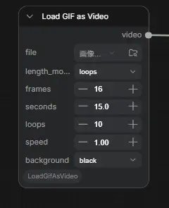

# ComfyUI-LoadGifAsVideo

**English** | [日本語](#日本語)



Two nodes for turning short looping material into a VIDEO stream of the length you actually need:

- **Load GIF as Video** — reads an animated GIF / APNG / animated WEBP from the ComfyUI input directory.
- **Loop Video** — takes any existing VIDEO (e.g. a short MP4 from the stock `Load Video`) and loops it.

## Why

An animated GIF can be opened with the stock `Load Video` node, but it plays through exactly once and then ends — which makes it awkward to use as source material. Most GIFs are drawn to be looped forever, so a single pass is rarely the clip you actually wanted.

These nodes start from the animation as it looks *while looping*, and let you cut video material out of it at any length you ask for — a number of frames, a duration in seconds, or a number of full loops — with an adjustable playback speed. A one-second GIF becomes a clean five-second clip without chaining an image-batch loader, a frame counter and `Create Video`.

## Nodes

### Load GIF as Video

| Input | Type | Description |
| --- | --- | --- |
| `file` | COMBO (upload) | Animated GIF / APNG / WEBP in the ComfyUI `input` directory. Drag-and-drop upload is supported. A new node starts blank and reports "No animation file selected" until you pick one. |
| `length_mode` | `frames` / `seconds` / `loops` | How the output length is specified. |
| `frames` | INT | Number of frames to output. Used when `length_mode = frames`. |
| `seconds` | FLOAT | Duration to output in seconds. Used when `length_mode = seconds`. |
| `loops` | INT | Number of times the animation plays through. Used when `length_mode = loops`. |
| `speed` | FLOAT | Playback speed multiplier (`1.0` = original speed, `2.0` = twice as fast). |
| `background` | `black` / `white` | Color that transparent pixels are composited over. |

| Output | Type | Description |
| --- | --- | --- |
| `video` | VIDEO | The animation as a video stream. Feed it to `Save Video` or any VIDEO input. |
| `images` | IMAGE | The same frames as an image batch, for feeding a sampler directly. Saves wiring up `Get Video Components`. |

### Loop Video

Loops any VIDEO — an MP4 or WEBM via the stock `Load Video`, a generated video, or the output of `Load GIF as Video`.

| Input | Type | Description |
| --- | --- | --- |
| `video` | VIDEO | The video to loop. |
| `length_mode` | `frames` / `seconds` / `loops` | How the output length is specified. |
| `frames` | INT | Number of frames to output. Used when `length_mode = frames`. |
| `seconds` | FLOAT | Duration to output in seconds. Used when `length_mode = seconds`. |
| `loops` | INT | Number of times the video plays through. Used when `length_mode = loops`. |
| `speed` | FLOAT | Playback speed multiplier. |

| Output | Type | Description |
| --- | --- | --- |
| `video` | VIDEO | The looped video. |
| `images` | IMAGE | The looped frames as an image batch. |

**Audio.** At `speed = 1.0` the audio is looped along with the frames: the source's audio is fitted to exactly one video loop (truncated or zero-padded) and then repeated, so every loop restarts in sync with frame 0. At any other speed only the frame rate changes, which would put the audio out of sync — so the audio is dropped. If you need the audio at a different speed, retime it separately.

## Behavior

The length and speed controls behave identically in both nodes.

**Frame rate is automatic.** The output frame rate comes from the source itself — its own rate multiplied by `speed`. There is no fps widget. Frames are never interpolated or dropped, so at `speed = 1.0` the output is a frame-for-frame copy of the source at its original timing.

**Looping.** If the requested length is longer than the source, it repeats from the beginning as many times as needed (and is cut off mid-loop if the length does not divide evenly). If the requested length is shorter, the source is simply truncated.

**`length_mode = loops`** gives you whole passes with no partial loop at the end: `loops = 3` on a 12-frame source is always exactly 36 frames. `speed` does not change that count — it only changes the frame rate, and therefore how long those 36 frames take to play.

**`seconds` and `speed` interact.** Because `speed` scales the output frame rate, asking for 2 seconds at `speed = 2.0` produces twice as many frames as at `speed = 1.0` — i.e. you see twice as much of the source in the same 2 seconds. That is the intended meaning of "faster".

**Frame limit.** Output is capped at 10000 frames; exceeding it raises rather than trying to allocate the memory.

### Load GIF as Video only

**Variable frame delays.** GIFs may give every frame a different delay. Since a video has one frame rate, such an animation is resampled (nearest frame, no blending) onto its own average rate; the frame count and the total duration are preserved. Animations with a single uniform delay pass through untouched.

**Transparency.** VIDEO carries no alpha channel, so transparent pixels are composited over the `background` color.

**Very short delays.** GIFs that declare a delay of 0ms or 10ms mean "as fast as possible"; browsers render those at 100ms and so does this node.

## Installation

Via ComfyUI Manager, or clone into `ComfyUI/custom_nodes/`:

```bash
cd ComfyUI/custom_nodes
git clone https://github.com/id-fa/ComfyUI-LoadGifAsVideo
```

Then restart ComfyUI. There are no extra Python dependencies — Pillow, NumPy and PyTorch all ship with ComfyUI.

Requires a ComfyUI version that has the `VIDEO` type (`comfy_api.input_impl`). On older builds the nodes load but raise a clear error when run.

## License

MIT

---

# 日本語

[English](#comfyui-loadgifasvideo) | **日本語**

短いループ素材を、実際に必要な長さの VIDEO ストリームに変換する 2 つのノードです。

- **Load GIF as Video** — ComfyUI の `input` ディレクトリにあるアニメーション GIF / APNG / アニメーション WEBP を読み込みます。
- **Loop Video** — 既存の VIDEO（標準の `Load Video` で読み込んだ短い MP4 など）を受け取ってループさせます。

## このノードの主旨

アニメ GIF ファイルは標準の `Load Video` ノードでも開くことができますが、1 回再生したところで終了してしまうため、素材として利用するのが難しいという問題がありました。GIF の多くは延々とループする前提で作られているので、1 周だけ再生したものが欲しかった映像であることはまずありません。

このノードでは、ループ再生している状態を出発点として、任意の再生時間 / フレーム数 / ループ回数で動画素材にできます。再生速度も調整できます。1 秒の GIF を 5 秒のクリップにするのに、画像バッチローダーとフレームカウンターと `Create Video` を繋ぐ必要はありません。

## ノード

### Load GIF as Video

| 入力 | 型 | 説明 |
| --- | --- | --- |
| `file` | COMBO（アップロード） | ComfyUI の `input` ディレクトリにあるアニメーション GIF / APNG / WEBP。ドラッグ & ドロップでのアップロードにも対応しています。ノードを追加した直後は未選択状態で、ファイルを選ぶまで "No animation file selected" と表示されます。 |
| `length_mode` | `frames` / `seconds` / `loops` | 出力の長さの指定方法。 |
| `frames` | INT | 出力するフレーム数。`length_mode = frames` のときに使用されます。 |
| `seconds` | FLOAT | 出力する長さ（秒）。`length_mode = seconds` のときに使用されます。 |
| `loops` | INT | アニメーションを再生する回数。`length_mode = loops` のときに使用されます。 |
| `speed` | FLOAT | 再生速度の倍率（`1.0` = 元の速度、`2.0` = 2 倍速）。 |
| `background` | `black` / `white` | 透明ピクセルを合成する背景色。 |

| 出力 | 型 | 説明 |
| --- | --- | --- |
| `video` | VIDEO | アニメーションを動画ストリームにしたもの。`Save Video` などの VIDEO 入力に繋げます。 |
| `images` | IMAGE | 同じフレームを画像バッチとして出力したもの。サンプラーに直接渡せるので、`Get Video Components` を挟む手間が省けます。 |

### Loop Video

任意の VIDEO をループさせます。標準の `Load Video` で読み込んだ MP4 や WEBM、生成した動画、`Load GIF as Video` の出力のいずれでも構いません。

| 入力 | 型 | 説明 |
| --- | --- | --- |
| `video` | VIDEO | ループさせる動画。 |
| `length_mode` | `frames` / `seconds` / `loops` | 出力の長さの指定方法。 |
| `frames` | INT | 出力するフレーム数。`length_mode = frames` のときに使用されます。 |
| `seconds` | FLOAT | 出力する長さ（秒）。`length_mode = seconds` のときに使用されます。 |
| `loops` | INT | 動画を再生する回数。`length_mode = loops` のときに使用されます。 |
| `speed` | FLOAT | 再生速度の倍率。 |

| 出力 | 型 | 説明 |
| --- | --- | --- |
| `video` | VIDEO | ループさせた動画。 |
| `images` | IMAGE | ループさせたフレームを画像バッチにしたもの。 |

**オーディオについて。** `speed = 1.0` のときは、フレームと一緒にオーディオもループします。元のオーディオをちょうど動画 1 ループ分の長さに合わせた（切り詰めるか、ゼロ埋めする）うえで繰り返すので、どのループもフレーム 0 と同期して始まります。それ以外の速度ではフレームレートだけが変化するため、オーディオがずれてしまいます。そのためオーディオは破棄されます。速度を変えたうえでオーディオが必要な場合は、別途タイムストレッチしてください。

## 動作

長さと速度の制御は、両方のノードで同じ挙動になります。

**フレームレートは自動です。** 出力のフレームレートはソース自身のレートに `speed` を掛けたもので、fps ウィジェットはありません。フレームの補間も間引きも行わないため、`speed = 1.0` では元のタイミングのままフレーム単位で忠実なコピーになります。

**ループ。** 要求された長さがソースより長い場合は、必要な回数だけ先頭から繰り返します（長さが割り切れない場合はループの途中で打ち切られます）。要求された長さのほうが短い場合は、単純に切り詰められます。

**`length_mode = loops`** では末尾に半端なループが残らず、必ず整数回の再生になります。12 フレームのソースに `loops = 3` を指定すれば常にちょうど 36 フレームです。`speed` はこのフレーム数を変えません。変わるのはフレームレート、つまりその 36 フレームの再生にかかる時間だけです。

**`seconds` と `speed` の関係。** `speed` は出力フレームレートを倍率で変えるため、`speed = 2.0` で 2 秒を指定すると `speed = 1.0` のときの 2 倍のフレーム数になります。つまり、同じ 2 秒間でソースを 2 倍見ることになります。これが「速くする」ということの意図した意味です。

**フレーム数の上限。** 出力は 10000 フレームで打ち切られます。超える場合はメモリを確保しようとせずエラーになります。

### Load GIF as Video のみ

**可変のフレームディレイ。** GIF はフレームごとに異なるディレイを持てます。動画のフレームレートは 1 つしかないため、そのようなアニメーションは自身の平均レートにリサンプリングされます（最近傍フレーム、ブレンドなし）。フレーム数と全体の長さは保たれます。ディレイが全フレーム一定のアニメーションは、そのまま無加工で通過します。

**透過。** VIDEO はアルファチャンネルを持たないため、透明ピクセルは `background` の色に合成されます。

**極端に短いディレイ。** ディレイに 0ms や 10ms を指定した GIF は「できるだけ速く」という意味です。ブラウザはこれを 100ms で再生するので、このノードも同じ扱いにします。

## インストール

ComfyUI Manager から導入するか、`ComfyUI/custom_nodes/` にクローンしてください。

```bash
cd ComfyUI/custom_nodes
git clone https://github.com/id-fa/ComfyUI-LoadGifAsVideo
```

その後 ComfyUI を再起動します。追加の Python 依存パッケージはありません（Pillow、NumPy、PyTorch はいずれも ComfyUI に同梱されています）。

`VIDEO` 型（`comfy_api.input_impl`）を持つバージョンの ComfyUI が必要です。それより古いビルドでもノードの読み込み自体は成功し、実行時に分かりやすいエラーを出します。

## ライセンス

MIT
